# UX User Story Testing

# Download CV Hyperlink
1.	When on any webpage.
2.	Scroll up to the header of the page or scroll down to the footer of the page.
3.	Then click on the Download My CV link shown in the header or footer.
4.	A new tab will open and display the CV. 
5.	From there the CV can be viewed, downloaded and printed. 

## Step 1
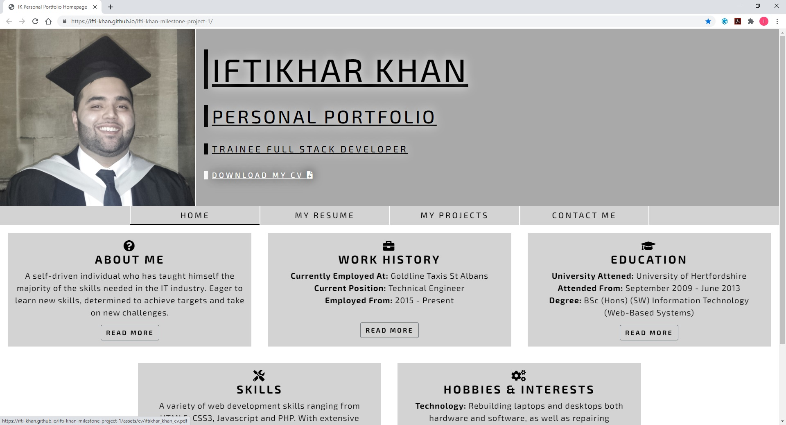

## Step 2

# Visual Markers
## Visual Marker – Current Page
1.	Go to the navigation bar on any webpage.
2.	In the navigation bar the current webpage will have a black border line below it indicating which page the user is currently on.

## Step 1
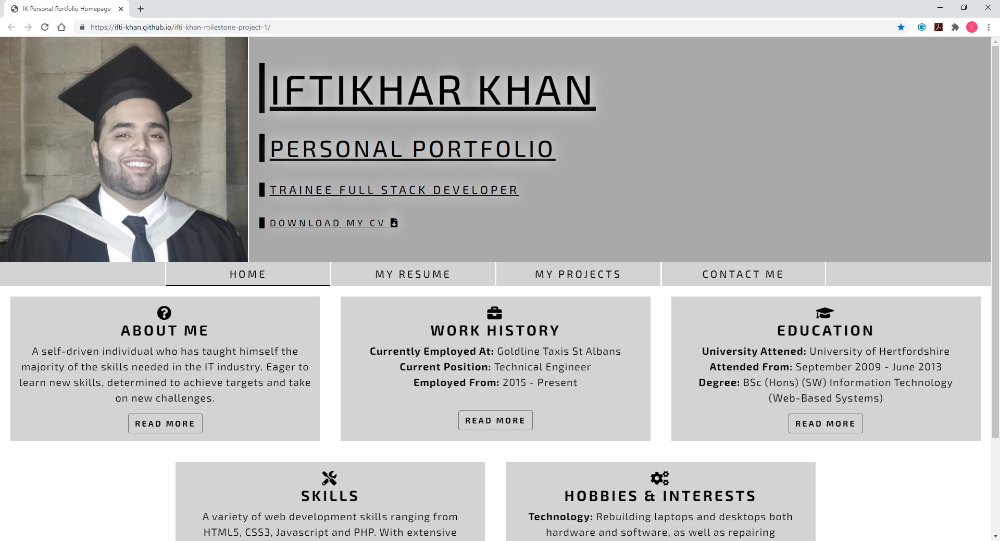

## Visual Marker – Hover Transition
1.	Go to the navigation bar on any webpage.
2.	Then hover over any webpage link in the navigation bar.
3.	Once hovering a sweep to right transition will display.

## Step 1
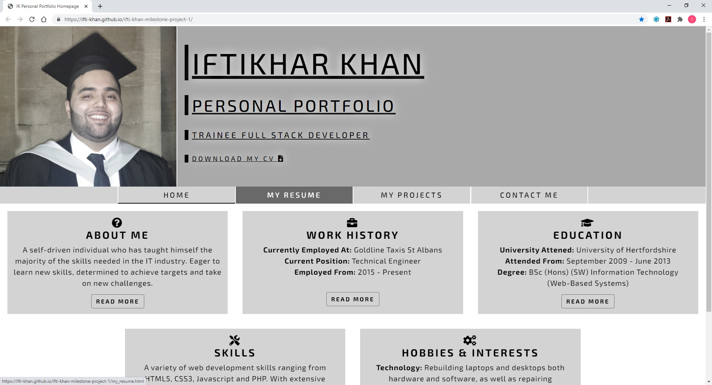

## Visual Marker – Hover Selector
1.	When on any webpage. 
2.	Scroll up to the header on the page.
3.	Go and hover over the Download My CV link in the header.
4.	The text colour will change from black to white.

## Step 1
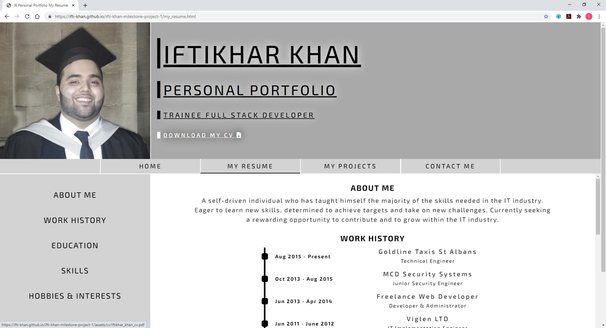

# Key Information and read more option
1.	When on the homepage. 
2.	Scroll down and view the five key points containing key information. 
3.	To find out more information click on the read more button.
4.	Once the button is clicked it will take you to resume page, to that exact section the key point is linked to with more information. 

## Step 1
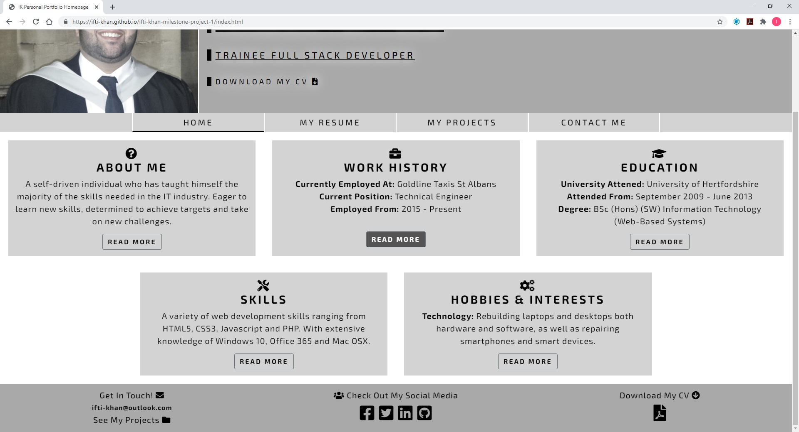

## Step 2
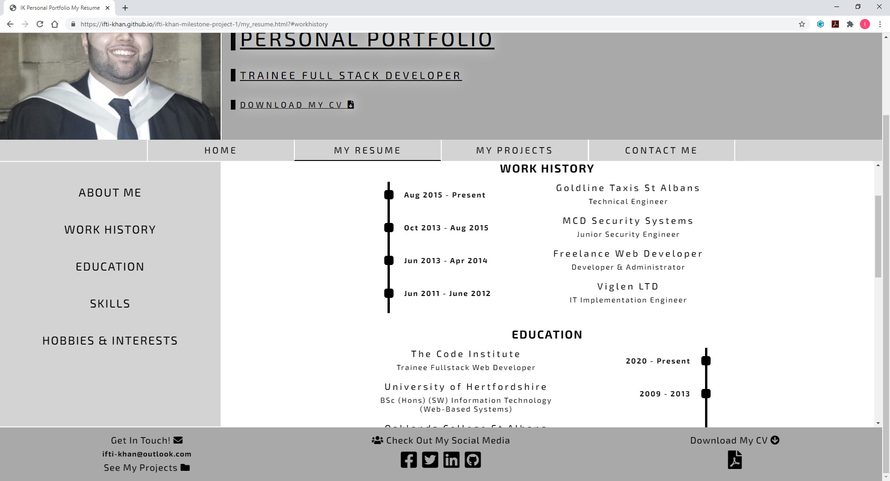

# External Live Project Links
1.	Go to the My Projects page.
2.	Scroll up and down the page to view the project list.
3.	To visit the project site click on the visit site button or click on the site thumbnail.
4.	A new tab will open and take the user to the project site. 

## Step 1
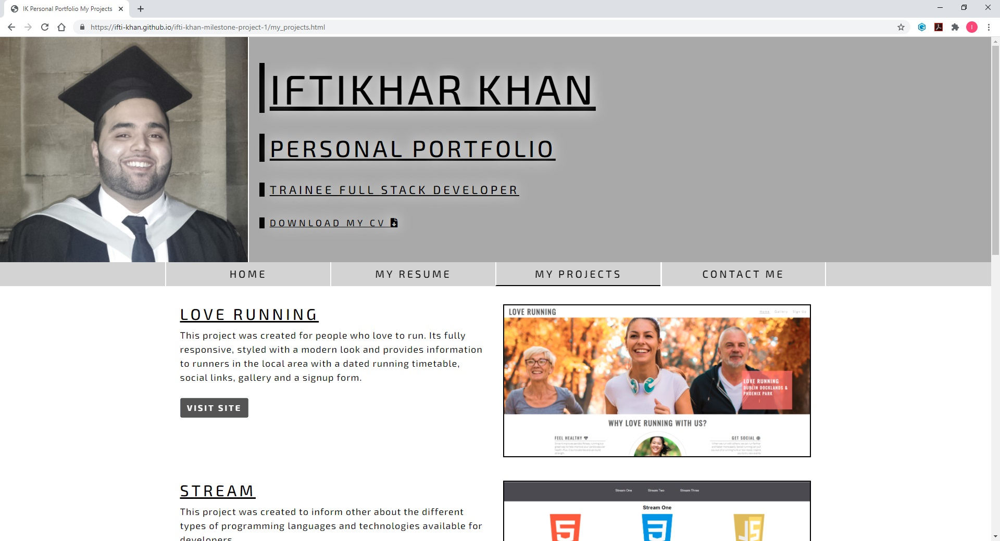

## Step 2
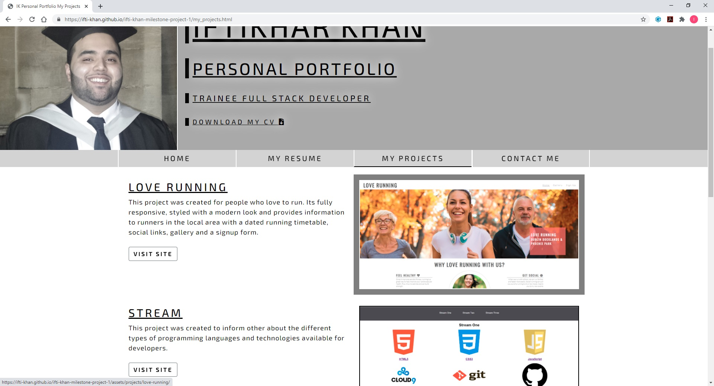

## Step 3
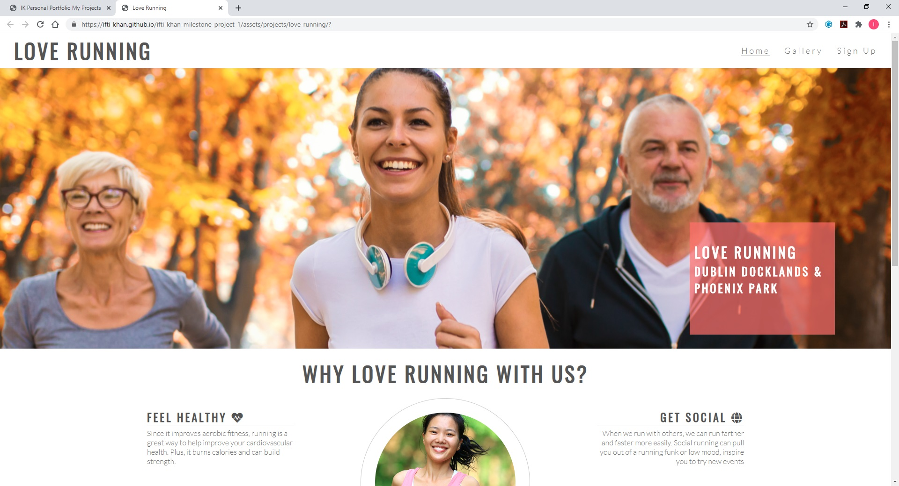

# Contact Form
1.	Go to the Contact Me page.
2.	Fill in all input fields with valid information.
3.	Leave no input field empty, if a field is empty and the send button is clicked, a validation popup will appear prompting you to fill in the field. 
4.	Once all input fields are filled in, press the send button. 
5.	Once the send button is clicked, it will inform the user the message has been sent successfully.

## Important notice:
This site feature does not work at the moment and is not connected to a server. But for now when the user clicks the send button instead of refreshing the page, it will take the user to another page informing them this site feature is under construction and to email me directly and from there they can return to the homepage.

## Step 1
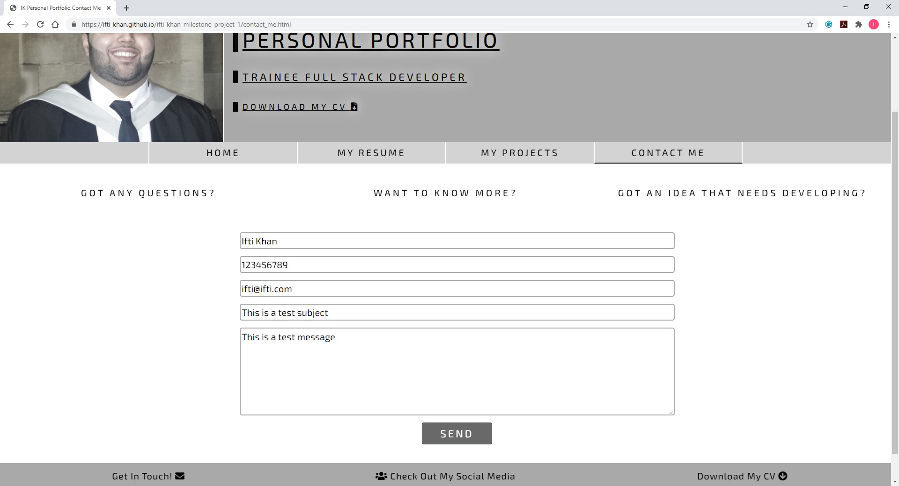

## Step 2
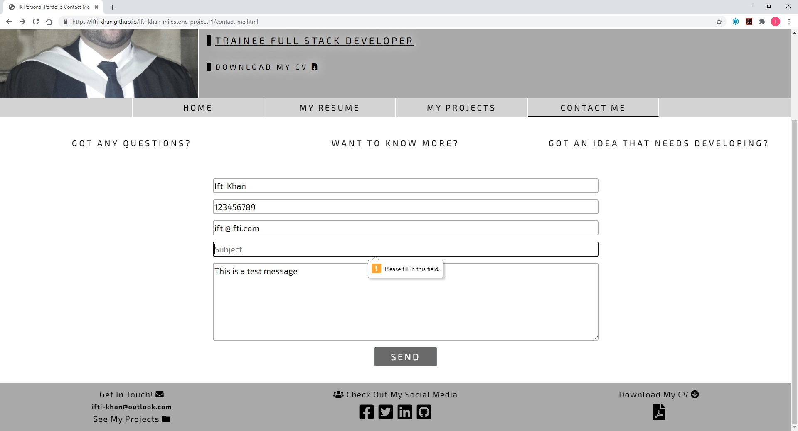

## Step 3
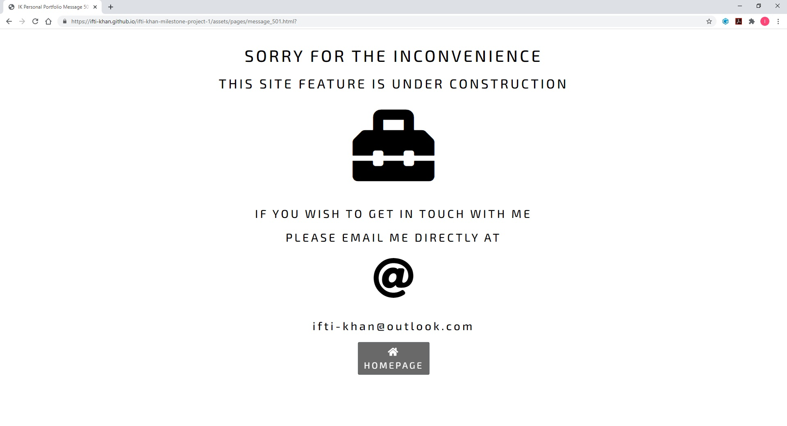

# Social Media Links
1.	When on any webpage.
2.	Scroll down to the footer of the webpage.
3.	In the footer, you will see social media icons.
4.	Clicking on any social media icon will open a new tab and take the user to my social media page. 

## Step 1
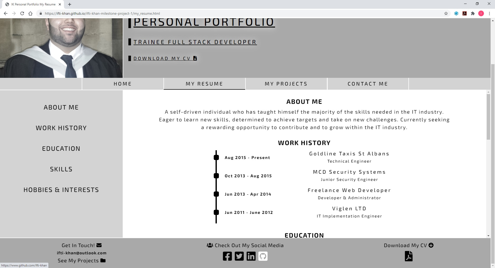

## Step 2
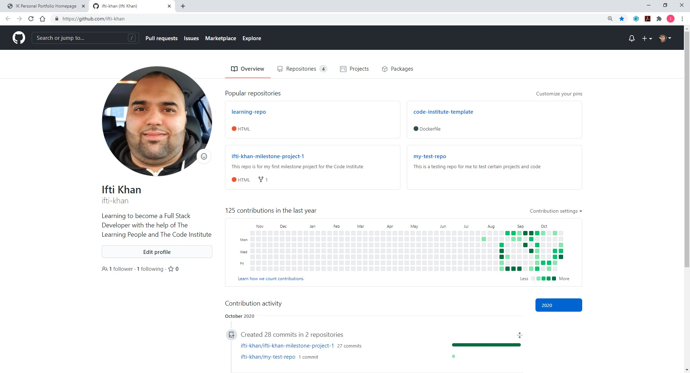

